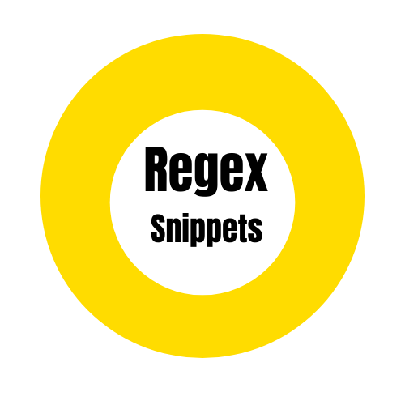

# Regex Vs code Extension

Regex for javascript,typescript,angular and react. With Bootstrap forms and formgroups

  

## ***Demo***
 

### Snippets

The following table shows all the 50+ code snippets included within this
extension

# Snippets
Trigger | Description
--- | ---
!vemail | Email Address Validation
!vhexcol |  Hexadecimal Color Validation   
!vpass | Password Validation
!visbn | ISBN Number Validation              
!vipv4 | IPV4 Address Validation
!vipv6 | IPV6 Address Validation
!vmmddyy | Date Validation In mm/dd/yy format
!vmonddyyyy | Date Validation In mon/dd/yyyy format
!vmonth | Month Validation
!vextprice | Extract Price Value from any string
!vparehead | Parse an Email Header to retrieve "To" address 
!vfbllink | Check if the given Facebook Profile Link is valid 
!vcc | Credit Card Validation  
!vusername | Username Validation with minimum and maximum characters 
!exturl | Extract URLs from a string  
!getiever | Get the current Internet Explorer Version being used
!vimage| Validate image filenames
!vcityabbr | Validate City Names
!vusphone | US Phone Number Validation 
!vssn | Social Security Number Validation 
!vhtmlcont | Verify if the given string contains content between the provided html tags
!vhtmltag | Validates if the given string has either a opening or closing HTML tag 
!vtwitter  | Twitter Username Validation                                                                                                                                       
!vurl | URL Validation 
!vgooglesyn | URL Validation
!vextcssmedia | Extract properties and values from CSS Media Queries 
!vexthtmlcomms | Strip all comments from a HTML Code Block                                                                                                
!vexthtmlcomms  | Strip all comments from a HTML Code Block                                                                                                                  !vextcss | Extract Individual CSS Properties from the given Code Block                                                          
!vextytid   | Extract Video ID from a valid Youtube Video Link
!vextimgsrc | Extract image source links from HTML Image Tags  
!vbase64 | Base64 String Validation
!vsepthousand | Seperates the digits in the string to thousand with commas
!vchars | Validate if the the string contains atleast one occurrence of the Character to be searched
!vspaces | Convert multiple spaces to single spaces between each word in a string
!vextsqrbracks | Extract Square Brackets and the content between them  
!valpnum | Non-Alphanumeric Characters Validation    
!vextlogs   | Extract native Javascript console and AngularJS                                            
!vextbrackscont | Extract all brackets and the content between them  
!vaddlinktag| Adds Link Tags to all the strings that start with http or https
!vfindocurrences  | Provides a function to calculate the number of times the provided character(s) 
!vuuidv1  | UUID v1 Validation     
!vuuidv2 | UUID v2 Validation 
!vuuidv3| UUID v3 Validation 
!vuuidv4 | UUID v4 Validation
!vuuidv5  | UUID v5 Validation                                                                                                                                                 
# Form Snippets

Trigger | Description
--- | ---
!form-blank |
!form-fullname |
!form-middlename |
!form-last-name |
!form-email |
!form-phone |
!form-street-address |
!form-street-1 |
!form-street-2 |
!form-street-3 |
!form-city |
!form-state |
!form-country |
!form-county |
!form-id |
!form-major |
!form-gpa |
!form-signature |
!form-date |
!form-time |
!form-select |
!form-file-upload |
!form-amount |
!form-radio-button |
!form-checkbox |

## Release Notes

Users appreciate release notes as you update your extension.

### 1.0.0

Initial release of ...

### 1.0.1

Fixed issue #.

### 1.1.0

Added features X, Y, and Z.

-----------------------------------------------------------------------------------------------------------

## Working with Markdown

**Note:** You can author your README using Visual Studio Code.  Here are some useful editor keyboard shortcuts:

* Split the editor (`Cmd+\` on macOS or `Ctrl+\` on Windows and Linux)
* Toggle preview (`Shift+CMD+V` on macOS or `Shift+Ctrl+V` on Windows and Linux)
* Press `Ctrl+Space` (Windows, Linux) or `Cmd+Space` (macOS) to see a list of Markdown snippets

### For more information

* [Visual Studio Code's Markdown Support](http://code.visualstudio.com/docs/languages/markdown)
* [Markdown Syntax Reference](https://help.github.com/articles/markdown-basics/)

**Enjoy!**
