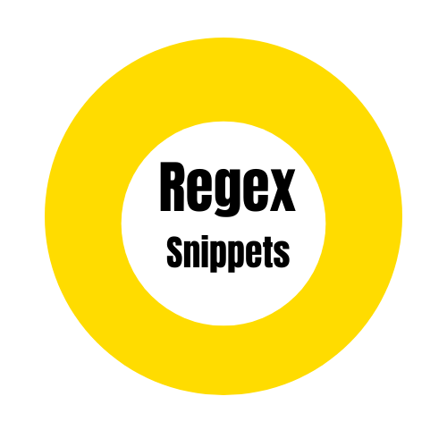

[](https://marketplace.visualstudio.com/publishers/Nishikanta12)
[](https://github.com/NishikantaRay/Vscode-Extension-for-Regex/issues)
[](https://github.com/NishikantaRay/Vscode-Extension-for-Regex/blob/main/LICENSE)
[](https://github.com/NishikantaRay/Vscode-Extension-for-Regex)
[](https://github.com/NishikantaRay/Vscode-Extension-for-Regex)

<p align="center">
  
</p>

## ✨ Features

### 🎯 **100+ Regex Snippets**
Comprehensive collection spanning 12 categories:
- **Validation Patterns** (25+ snippets): Email, passwords, URLs, phone numbers
- **Date & Time** (15+ snippets): Various date formats, time validation
- **Web & Social Media** (20+ snippets): YouTube, GitHub, Twitter, Discord links
- **Colors & Design** (10+ snippets): Hex, RGB, HSL color validation
- **Development** (15+ snippets): Semantic versioning, Docker, MongoDB IDs
- **Geographic** (8+ snippets): Coordinates, ZIP codes, license plates
- **Security** (12+ snippets): JWT tokens, API keys, cryptocurrency addresses

### 🌐 **Multi-Language Support**
**8 Programming Languages** with native patterns:
- **JavaScript/TypeScript** - ES6+ syntax, async/await patterns
- **Python** - Django/Flask validators, re module examples
- **PHP** - Laravel validation, preg_match patterns
- **Java** - Pattern class, Spring Boot integration
- **C#** - .NET Core validators, Regex class
- **Go** - regexp package, concurrent validation
- **Rust** - regex crate, error handling patterns
- **HTML5** - Form validation attributes, input patterns

### 🧪 **Interactive Regex Tester**
**Real-time testing environment** with:
- Live pattern validation as you type
- Syntax highlighting for regex components
- Match highlighting in test strings
- Capture group extraction with indices
- Performance benchmarking (execution time)
- Error detection with helpful suggestions
- Export results to different formats

### 📖 **Advanced Pattern Explanations**
**AI-powered breakdown system**:
- Character-by-character analysis
- Visual diagram generation
- Common use case examples
- Performance impact analysis
- Alternative pattern suggestions
- Security considerations
- Cross-browser compatibility notes

### 🎨 **Bootstrap 5 Form Components**
**25+ Ready-to-use components**:
- Complete form templates with validation
- Real-time validation feedback
- Custom error message styling
- Multi-step form wizards
- File upload with preview
- Dynamic field addition/removal
- Accessibility-compliant markup

### ⚡ **Smart Auto-completion**
**IntelliSense integration** featuring:
- Context-aware snippet suggestions
- Parameter hints for complex patterns
- Documentation on hover
- Snippet ranking based on usage
- Custom snippet creation
- Quick fixes for common errors

### 🔧 **AI-Powered Regex Generator**
**Generate patterns from examples**:
- Natural language to regex conversion
- Multiple example input support
- Pattern optimization suggestions
- Test case generation
- Edge case detection
- Performance optimization

### 📱 **Modern Web Patterns**
**Latest standards support**:
- JWT token validation (all algorithms)
- Cryptocurrency addresses (Bitcoin, Ethereum, etc.)
- Social media handles and URLs
- API endpoint validation
- Webhook URL patterns
- OAuth token formats
- GraphQL query validation

## 🚀 Quick Start

1. **Install** the extension from VS Code Marketplace
2. **Type** any trigger (starts with `!`) to see available snippets
3. **Use** commands from Command Palette (`Ctrl+Shift+P`):
   - `Regex: Test Regex Pattern`
   - `Regex: Explain Regex Pattern` 
   - `Regex: Generate Regex from Examples`

## 🎬 Demo


*Live demonstration of the Regex extension in action - showing snippet auto-completion, pattern validation, and interactive testing features.*

## 📋 Regex Snippets Categories

### 🔐 Validation Patterns

| Trigger | Description | Example | Use Cases |
|---------|-------------|----------|----------|
| `!vemail` | Email validation (RFC 5322) | `user.name+tag@example.co.uk` | Registration forms, contact validation |
| `!vemail-strict` | Strict email validation | `simple@domain.com` | High-security applications |
| `!vemail-loose` | Permissive email validation | `user@sub.domain.info` | Newsletter signups |
| `!vpass` | Strong password (8+ chars) | `MySecure123!` | User registration |
| `!vpass-medium` | Medium password (6+ chars) | `Pass123!` | Internal systems |
| `!vpass-strong` | Very strong password | `Str0ng!P@ssw0rd#2025` | Banking, admin panels |
| `!vurl` | URL validation (HTTP/HTTPS) | `https://sub.example.com/path` | Link validation, bookmarks |
| `!vurl-strict` | Strict URL with protocol | `https://example.com` | API endpoints |
| `!vurl-any` | Any protocol URL | `ftp://files.example.com` | Universal link validator |
| `!vphone` | International phone | `+1-555-123-4567` | Contact forms |
| `!vphone-us` | US phone format | `(555) 123-4567` | US-specific forms |
| `!vphone-intl` | E.164 format | `+14155552671` | SMS/calling systems |
| `!vcc` | Credit card (all types) | `4532-1234-5678-9012` | Payment forms |
| `!vcc-visa` | Visa card validation | `4000-0000-0000-0002` | Visa-specific validation |
| `!vcc-master` | Mastercard validation | `5555-5555-5555-4444` | Mastercard processing |
| `!vcc-amex` | American Express | `3782-822463-10005` | AMEX validation |
| `!vipv4` | IPv4 address | `192.168.1.1` | Network configuration |
| `!vipv4-private` | Private IPv4 ranges | `10.0.0.1` | Internal networks |
| `!vipv6` | IPv6 address | `2001:0db8:85a3::8a2e:0370:7334` | Modern networking |
| `!vjwt` | JWT token validation | `eyJhbGc...` | API authentication |
| `!vjwt-header` | JWT header only | `eyJhbGciOiJIUzI1NiJ9` | Token parsing |
| `!vmac` | MAC address | `00:1B:44:11:3A:B7` | Network devices |
| `!vmac-colon` | MAC with colons | `00:1b:44:11:3a:b7` | Linux systems |
| `!vmac-dash` | MAC with dashes | `00-1b-44-11-3a-b7` | Windows systems |
| `!vbtc` | Bitcoin address | `1A1zP1eP5QGefi2DMPTfTL5SLmv7DivfNa` | Crypto payments |
| `!veth` | Ethereum address | `0x742d35Cc6a0c4532D3Ba5e3d4207A14f7fAB3A0a` | Smart contracts |
| `!vltc` | Litecoin address | `LdP8Qox1VAhCzLJNqrr74YovaWYyNBUWvL` | LTC transactions |
| `!vssn` | Social Security Number | `123-45-6789` | Government forms |
| `!vtin` | Tax ID Number | `12-3456789` | Tax documents |
| `!visbn` | ISBN validation | `978-3-16-148410-0` | Book cataloging |

### 📅 Date & Time Patterns

| Trigger | Description | Format |
|---------|-------------|--------|
| `!vdate` | Date validation | `YYYY-MM-DD`, `DD/MM/YYYY` |
| `!vtime24` | 24-hour time | `HH:MM` or `HH:MM:SS` |
| `!vtime12` | 12-hour time | `HH:MM AM/PM` |
| `!vmonth` | Month names | `January`, `Jan` |

### 🌐 Web & Social Media

| Trigger | Description | Validates |
|---------|-------------|-----------|
| `!vyoutube` | YouTube URLs | Video URLs and IDs |
| `!vgithub` | GitHub repos | Repository URLs |
| `!vtwitter` | Twitter handles | `@username` |
| `!vfacebook` | Facebook profiles | Profile URLs |
| `!vdiscord` | Discord invites | Invite links |
| `!vslack` | Slack webhooks | Webhook URLs |

### 🎨 Colors & Design

| Trigger | Description | Format |
|---------|-------------|--------|
| `!vhex` | Hex colors | `#FF5733`, `#RGB` |
| `!vhexalpha` | Hex with alpha | `#FF5733AA` |
| `!vrgb` | RGB colors | `rgb(255, 87, 51)` |
| `!vrgba` | RGBA colors | `rgba(255, 87, 51, 0.5)` |
| `!vhsl` | HSL colors | `hsl(360, 100%, 50%)` |

### 💻 Development Patterns

| Trigger | Description | Use Case |
|---------|-------------|----------|
| `!vsemver` | Semantic versions | `1.2.3`, `2.0.0-alpha.1` |
| `!vdocker` | Docker images | `nginx:latest`, `node:16-alpine` |
| `!vs3bucket` | AWS S3 buckets | Bucket naming rules |
| `!vmongoid` | MongoDB ObjectID | 24-char hex strings |
| `!vuuid` | UUID validation | All UUID versions |

### 📱 Geographic & Location

| Trigger | Description | Range |
|---------|-------------|-------|
| `!vlat` | Latitude | -90 to 90 degrees |
| `!vlng` | Longitude | -180 to 180 degrees |
| `!vzip` | ZIP codes | US postal codes |
| `!vlicense` | License plates | US formats |

## 🎯 Language-Specific Snippets

### Python Regex (`!py-*`)
```python
# Email validation with re module
import re
email_pattern = re.compile(r'^[a-zA-Z0-9._%+-]+@[a-zA-Z0-9.-]+\.[a-zA-Z]{2,}$')
if email_pattern.match('test@example.com'):
    print('Valid email')
```

### PHP Regex (`!php-*`)
```php
// URL validation
if (filter_var($url, FILTER_VALIDATE_URL)) {
    echo "Valid URL";
}
// Alternative with preg_match
if (preg_match('/^https?:\/\/[^\s$.?#].[^\s]*$/i', $url)) {
    echo "Valid URL (regex)";
}
```

### Java Regex (`!java-*`)
```java
// Email validation with Pattern class
Pattern emailPattern = Pattern.compile("^[a-zA-Z0-9._%+-]+@[a-zA-Z0-9.-]+\\.[a-zA-Z]{2,}$");
boolean isValid = emailPattern.matcher(email).matches();
```

### C# Regex (`!cs-*`)
```csharp
// Password strength validation
private static readonly Regex passwordRegex = new Regex(
    @"^(?=.*[a-z])(?=.*[A-Z])(?=.*\d)(?=.*[@$!%*?&])[A-Za-z\d@$!%*?&]{8,}$",
    RegexOptions.Compiled);
```

### Go Regex (`!go-*`)
```go
// Email validation in Go
package main
import (
    "fmt"
    "regexp"
)

func validateEmail(email string) bool {
    pattern := `^[a-zA-Z0-9._%+-]+@[a-zA-Z0-9.-]+\.[a-zA-Z]{2,}$`
    matched, _ := regexp.MatchString(pattern, email)
    return matched
}
```

### Rust Regex (`!rust-*`)
```rust
// Using the regex crate
use regex::Regex;

fn validate_url(url: &str) -> bool {
    let re = Regex::new(r"^https?://[^\s$.?#].[^\s]*$").unwrap();
    re.is_match(url)
}
```

## 🎨 Bootstrap 5 Form Components

### Complete Forms (`!bs5-*`)
- `!bs5-form-example` - Comprehensive validation form with live feedback
- `!bs5-multistep` - Multi-step form with progress indicator
- `!bs5-validation-form` - Form with regex validation patterns
- `!bs5-dynamic-fields` - Add/remove fields dynamically
- `!bs5-file-preview` - File upload with image preview

### Form Fields (`!form-*`)
- `!form-email` - Email input with validation feedback
- `!form-password` - Password with strength indicator
- `!form-phone` - Phone number input with formatting
- `!form-fullname` - Full name field validation
- `!form-date` - Date picker with constraints
- `!form-select` - Dropdown selection with validation
- `!form-checkbox` - Checkbox with custom styling
- `!form-radio-button` - Radio button group

## 🛠️ Extension Commands

### 🧪 Test Regex Pattern
1. Select a regex pattern in your code
2. Run `Regex: Test Regex Pattern` from Command Palette
3. Enter test string in the input field
4. View results in interactive webview with:
   - ✅/❌ Match status with highlighting
   - 📋 Captured groups with indices
   - 🔍 Detailed match information
   - 📊 Performance metrics

### 📖 Explain Regex Pattern
1. Select a regex pattern in your editor
2. Run `Regex: Explain Regex Pattern` from Command Palette
3. Get comprehensive explanation with:
   - 🧩 Pattern breakdown (character by character)
   - 📚 Common elements reference guide
   - 💡 Real-world use case examples
   - ⚠️ Common pitfalls and alternatives

### 🔧 Generate Regex from Examples
1. Run `Regex: Generate Regex from Examples` from Command Palette
2. Provide comma-separated test examples
3. Get AI-suggested regex pattern
4. Review, test, and refine as needed
5. Copy to clipboard when satisfied

## ⚙️ Extension Settings

Customize the Regex extension behavior through VS Code settings:

```json
{
  "regex.enableAutoComplete": true,
  "regex.showExplanations": true,
  "regex.preferredRegexFlavor": "javascript",
  "regex.includeProgrammingLanguages": [
    "javascript", "typescript", "python", "php", "java", "csharp", "go", "rust"
  ],
  "regex.enableInteractiveTesting": true,
  "regex.showPerformanceMetrics": true,
  "regex.autoSavePatterns": true
}
```

### Settings Description

- `enableAutoComplete`: Enable/disable snippet auto-completion
- `showExplanations`: Show detailed pattern explanations
- `preferredRegexFlavor`: Default regex flavor for testing
- `includeProgrammingLanguages`: Languages to include in snippets
- `enableInteractiveTesting`: Enable the built-in regex tester
- `showPerformanceMetrics`: Display pattern performance data
- `autoSavePatterns`: Automatically save tested patterns

## 🚀 Performance & Security Best Practices

### ⚡ **Performance Optimization**

#### **Compilation & Caching**
```javascript
// ✅ Good - Compile once, use many times
const emailRegex = /^[a-zA-Z0-9._%+-]+@[a-zA-Z0-9.-]+\.[a-zA-Z]{2,}$/;
const isValid = emailRegex.test(email);

// ❌ Bad - Recompiles every time
const isValid = /^[a-zA-Z0-9._%+-]+@[a-zA-Z0-9.-]+\.[a-zA-Z]{2,}$/.test(email);
```

#### **Anchor Usage**
```javascript
// ✅ Good - Anchored for full match
const phoneRegex = /^\+?[1-9]\d{1,14}$/;

// ❌ Bad - Partial matching can be slow
const phoneRegex = /\+?[1-9]\d{1,14}/;
```

#### **Quantifier Optimization**
```javascript
// ✅ Good - Specific quantifiers
const zipRegex = /^\d{5}(-\d{4})?$/;

// ❌ Bad - Greedy quantifiers
const zipRegex = /^\d+(-\d+)?$/;
```

#### **Non-Capturing Groups**
```javascript
// ✅ Good - Non-capturing when you don't need the match
const urlRegex = /^(?:https?:\/\/)?[\w.-]+\.[a-z]{2,}$/i;

// ❌ Bad - Unnecessary capturing
const urlRegex = /^(https?:\/\/)?[\w.-]+\.[a-z]{2,}$/i;
```

### 🔒 **Security Considerations**

#### **ReDoS (Regular Expression Denial of Service) Prevention**
```javascript
// ✅ Safe - Linear time complexity
const safeRegex = /^[a-zA-Z0-9._%+-]+@[a-zA-Z0-9.-]+\.[a-zA-Z]{2,}$/;

// ⚠️ Dangerous - Exponential time complexity
const dangerousRegex = /^([a-zA-Z0-9]*)*$/;
```

#### **Input Validation**
- **Always validate input length** before regex processing
- **Set timeouts** for regex operations in production
- **Use whitelist patterns** instead of blacklist when possible
- **Sanitize inputs** before regex matching

#### **Injection Prevention**
```javascript
// ✅ Safe - Escaped user input
const userInput = escapeRegExp(userString);
const searchRegex = new RegExp(userInput, 'i');

// ❌ Dangerous - Direct user input
const searchRegex = new RegExp(userString, 'i');
```

### 📊 **Performance Benchmarking**

Use the built-in performance metrics to:
- **Compare pattern variants** for speed
- **Identify bottlenecks** in complex patterns
- **Optimize for your specific use case**
- **Monitor production performance**

### 🧪 **Testing Strategies**

#### **Edge Case Testing**
- Empty strings and null values
- Maximum length inputs
- Unicode and special characters
- Malformed data patterns
- Boundary conditions

#### **Performance Testing**
```javascript
// Performance testing template
const testPattern = (regex, testCases) => {
  const start = performance.now();
  testCases.forEach(test => regex.test(test));
  const end = performance.now();
  console.log(`Pattern took ${end - start} ms`);
};
```

### 🔍 **Debugging Complex Patterns**

1. **Break down complex patterns** into smaller components
2. **Use the explanation feature** to understand each part
3. **Test incrementally** as you build the pattern
4. **Document your regex** with comments
5. **Use named capturing groups** when available

### 📈 **Scalability Guidelines**

- **Batch processing**: Group validation operations
- **Async validation**: Use non-blocking patterns for UI
- **Caching results**: Store validation outcomes
- **Progressive validation**: Validate as user types
- **Server-side validation**: Always validate on backend too

## 🤝 Contributing

We welcome contributions! Here's how you can help:

1. **Report bugs** - Open an issue with detailed reproduction steps
2. **Suggest patterns** - Request new regex snippets with use cases
3. **Add languages** - Contribute language-specific snippets
4. **Improve docs** - Fix typos, add examples, clarify explanations
5. **Submit PRs** - Follow our coding standards and include tests

### Development Setup

```bash
# Clone the repository
git clone https://github.com/NishikantaRay/Vscode-Extension-for-Regex.git
cd Vscode-Extension-for-Regex

# Install dependencies
npm install

# Build the extension
npm run compile

# Package the extension
vsce package

# Test locally
code --install-extension regex-1.0.0.vsix
```

### Testing

```bash
# Run unit tests
npm test

# Test specific patterns
npm run test:patterns

# Validate all snippets
npm run validate:snippets
```

## 🌟 Real-World Examples & Use Cases

### 🏢 **Enterprise Applications**

#### **User Management System**
```javascript
// Complete user validation suite
const validators = {
  email: /^[a-zA-Z0-9._%+-]+@[a-zA-Z0-9.-]+\.[a-zA-Z]{2,}$/,
  password: /^(?=.*[a-z])(?=.*[A-Z])(?=.*\d)(?=.*[@$!%*?&])[A-Za-z\d@$!%*?&]{8,}$/,
  phone: /^\+?[1-9]\d{1,14}$/,
  username: /^[a-zA-Z0-9._-]{3,20}$/
};

// Usage in registration form
function validateUser(userData) {
  const errors = {};
  if (!validators.email.test(userData.email)) {
    errors.email = 'Invalid email format';
  }
  if (!validators.password.test(userData.password)) {
    errors.password = 'Password must be 8+ characters with mixed case, numbers, and symbols';
  }
  return Object.keys(errors).length === 0 ? null : errors;
}
```

#### **API Input Validation**
```python
# Django REST Framework validators
import re
from rest_framework import serializers

class UserSerializer(serializers.Serializer):
    email = serializers.RegexField(
        regex=r'^[a-zA-Z0-9._%+-]+@[a-zA-Z0-9.-]+\.[a-zA-Z]{2,}$',
        error_message='Invalid email format'
    )
    api_key = serializers.RegexField(
        regex=r'^[a-zA-Z0-9]{32}$',
        error_message='API key must be 32 alphanumeric characters'
    )
```

### 🛒 **E-commerce Applications**

#### **Payment Processing**
```php
<?php
// Laravel payment validation
class PaymentController extends Controller {
    public function validatePayment(Request $request) {
        $request->validate([
            'credit_card' => ['required', 'regex:/^[0-9]{4}[-\s]?[0-9]{4}[-\s]?[0-9]{4}[-\s]?[0-9]{4}$/'],
            'cvv' => ['required', 'regex:/^[0-9]{3,4}$/'],
            'expiry' => ['required', 'regex:/^(0[1-9]|1[0-2])\/([0-9]{2})$/'],
            'amount' => ['required', 'regex:/^\d+(\.\d{1,2})?$/'],
        ]);
    }
}
?>
```

#### **Product SKU Generation**
```java
// Spring Boot product validation
@Entity
public class Product {
    @Pattern(regexp = "^[A-Z]{2}[0-9]{6}$", 
             message = "SKU must be 2 uppercase letters followed by 6 digits")
    private String sku;
    
    @Pattern(regexp = "^[0-9]{12}$", 
             message = "UPC must be exactly 12 digits")
    private String upc;
}
```

### 📊 **Data Processing & Analytics**

#### **Log File Analysis**
```python
# Python log processing
import re
from datetime import datetime

class LogAnalyzer:
    def __init__(self):
        self.patterns = {
            'ip': r'\b(?:[0-9]{1,3}\.){3}[0-9]{1,3}\b',
            'timestamp': r'\[(\d{2}/\w{3}/\d{4}:\d{2}:\d{2}:\d{2}\s[+-]\d{4})\]',
            'status_code': r'"\s(\d{3})\s',
            'user_agent': r'"([^"]+)"$',
            'request_size': r'\s(\d+)\s"'
        }
    
    def parse_log_line(self, line):
        data = {}
        for key, pattern in self.patterns.items():
            match = re.search(pattern, line)
            data[key] = match.group(1) if match else None
        return data
```

### 🔐 **Security Applications**

#### **Input Sanitization**
```csharp
// C# security validation
public class SecurityValidator
{
    private static readonly Dictionary<string, Regex> SecurityPatterns = new()
    {
        { "NoSQLInjection", new Regex(@"[${}]|javascript:|data:|vbscript:", RegexOptions.IgnoreCase) },
        { "XSSPrevention", new Regex(@"<script[^>]*>.*?</script>|on\w+\s*=|<iframe[^>]*>", RegexOptions.IgnoreCase) },
        { "PathTraversal", new Regex(@"\.\.[\/\\]|%2e%2e[\/\\]") },
        { "SafeFilename", new Regex(@"^[a-zA-Z0-9._-]+$") }
    };
    
    public static bool IsInputSafe(string input, string validationType)
    {
        if (!SecurityPatterns.ContainsKey(validationType))
            return false;
            
        return !SecurityPatterns[validationType].IsMatch(input);
    }
}
```

### 🌐 **Web Scraping & Data Extraction**

#### **Content Extraction**
```go
// Go web scraping patterns
package main

import (
    "regexp"
    "fmt"
)

type ContentExtractor struct {
    emailPattern    *regexp.Regexp
    phonePattern    *regexp.Regexp
    urlPattern      *regexp.Regexp
    socialPattern   *regexp.Regexp
}

func NewContentExtractor() *ContentExtractor {
    return &ContentExtractor{
        emailPattern:  regexp.MustCompile(`[a-zA-Z0-9._%+-]+@[a-zA-Z0-9.-]+\.[a-zA-Z]{2,}`),
        phonePattern:  regexp.MustCompile(`\+?[1-9]\d{1,14}`),
        urlPattern:    regexp.MustCompile(`https?://[^\s]+`),
        socialPattern: regexp.MustCompile(`@[a-zA-Z0-9_]{1,15}`),
    }
}

func (ce *ContentExtractor) ExtractAll(text string) map[string][]string {
    return map[string][]string{
        "emails":  ce.emailPattern.FindAllString(text, -1),
        "phones":  ce.phonePattern.FindAllString(text, -1),
        "urls":    ce.urlPattern.FindAllString(text, -1),
        "handles": ce.socialPattern.FindAllString(text, -1),
    }
}
```

### 📱 **Mobile App Development**

#### **React Native Form Validation**
```javascript
// React Native validation hooks
import { useState, useCallback } from 'react';

const useFormValidation = () => {
  const [errors, setErrors] = useState({});
  
  const validators = {
    email: /^[a-zA-Z0-9._%+-]+@[a-zA-Z0-9.-]+\.[a-zA-Z]{2,}$/,
    phone: /^\+?[1-9]\d{1,14}$/,
    password: /^(?=.*[a-z])(?=.*[A-Z])(?=.*\d)(?=.*[@$!%*?&])[A-Za-z\d@$!%*?&]{8,}$/,
    zipCode: /^\d{5}(-\d{4})?$/,
  };
  
  const validate = useCallback((field, value) => {
    if (!validators[field]) return true;
    
    const isValid = validators[field].test(value);
    setErrors(prev => ({
      ...prev,
      [field]: isValid ? null : `Invalid ${field} format`
    }));
    
    return isValid;
  }, []);
  
  return { validate, errors };
};
```

### 🤖 **DevOps & Automation**

#### **CI/CD Pipeline Validation**
```yaml
# GitHub Actions with regex validation
name: Validate Commit Messages
on: [push, pull_request]

jobs:
  validate:
    runs-on: ubuntu-latest
    steps:
    - name: Check commit message format
      run: |
        if ! echo "${{ github.event.head_commit.message }}" | grep -qE "^(feat|fix|docs|style|refactor|test|chore)(\(.+\))?: .+$"; then
          echo "❌ Commit message must follow conventional commits format"
          echo "Examples: feat: add new feature, fix(auth): resolve login issue"
          exit 1
        fi
        echo "✅ Commit message format is valid"
```

## 🌟 Real-World Examples & Use Cases

### 🏢 **Enterprise Applications**

#### **User Management System**
```javascript
// Complete user validation suite
const validators = {
  email: /^[a-zA-Z0-9._%+-]+@[a-zA-Z0-9.-]+\.[a-zA-Z]{2,}$/,
  password: /^(?=.*[a-z])(?=.*[A-Z])(?=.*\d)(?=.*[@$!%*?&])[A-Za-z\d@$!%*?&]{8,}$/,
  phone: /^\+?[1-9]\d{1,14}$/,
  username: /^[a-zA-Z0-9._-]{3,20}$/
};

// Usage in registration form
function validateUser(userData) {
  const errors = {};
  if (!validators.email.test(userData.email)) {
    errors.email = 'Invalid email format';
  }
  if (!validators.password.test(userData.password)) {
    errors.password = 'Password must be 8+ characters with mixed case, numbers, and symbols';
  }
  return Object.keys(errors).length === 0 ? null : errors;
}
```

#### **API Input Validation**
```python
# Django REST Framework validators
import re
from rest_framework import serializers

class UserSerializer(serializers.Serializer):
    email = serializers.RegexField(
        regex=r'^[a-zA-Z0-9._%+-]+@[a-zA-Z0-9.-]+\.[a-zA-Z]{2,}$',
        error_message='Invalid email format'
    )
    api_key = serializers.RegexField(
        regex=r'^[a-zA-Z0-9]{32}$',
        error_message='API key must be 32 alphanumeric characters'
    )
```

### 🛒 **E-commerce Applications**

#### **Payment Processing**
```php
<?php
// Laravel payment validation
class PaymentController extends Controller {
    public function validatePayment(Request $request) {
        $request->validate([
            'credit_card' => ['required', 'regex:/^[0-9]{4}[-\s]?[0-9]{4}[-\s]?[0-9]{4}[-\s]?[0-9]{4}$/'],
            'cvv' => ['required', 'regex:/^[0-9]{3,4}$/'],
            'expiry' => ['required', 'regex:/^(0[1-9]|1[0-2])\/([0-9]{2})$/'],
            'amount' => ['required', 'regex:/^\d+(\.\d{1,2})?$/'],
        ]);
    }
}
?>
```

### 📊 **Data Processing & Analytics**

#### **Log File Analysis**
```python
# Python log processing
import re
from datetime import datetime

class LogAnalyzer:
    def __init__(self):
        self.patterns = {
            'ip': r'\b(?:[0-9]{1,3}\.){3}[0-9]{1,3}\b',
            'timestamp': r'\[(\d{2}/\w{3}/\d{4}:\d{2}:\d{2}:\d{2}\s[+-]\d{4})\]',
            'status_code': r'"\s(\d{3})\s',
            'user_agent': r'"([^"]+)"$',
            'request_size': r'\s(\d+)\s"'
        }
    
    def parse_log_line(self, line):
        data = {}
        for key, pattern in self.patterns.items():
            match = re.search(pattern, line)
            data[key] = match.group(1) if match else None
        return data
```

### 🔐 **Security Applications**

#### **Input Sanitization**
```csharp
// C# security validation
public class SecurityValidator
{
    private static readonly Dictionary<string, Regex> SecurityPatterns = new()
    {
        { "NoSQLInjection", new Regex(@"[${}]|javascript:|data:|vbscript:", RegexOptions.IgnoreCase) },
        { "XSSPrevention", new Regex(@"<script[^>]*>.*?</script>|on\w+\s*=|<iframe[^>]*>", RegexOptions.IgnoreCase) },
        { "PathTraversal", new Regex(@"\.\.[\/\\]|%2e%2e[\/\\]") },
        { "SafeFilename", new Regex(@"^[a-zA-Z0-9._-]+$") }
    };
    
    public static bool IsInputSafe(string input, string validationType)
    {
        if (!SecurityPatterns.ContainsKey(validationType))
            return false;
            
        return !SecurityPatterns[validationType].IsMatch(input);
    }
}
```

## ⌨️ Keyboard Shortcuts & Workflows

### 🚀 **Quick Access Shortcuts**

| Shortcut | Action | Description |
|----------|--------|-------------|
| `Ctrl+Shift+R` | Open Regex Tester | Launch interactive testing panel |
| `Ctrl+Alt+E` | Explain Pattern | Get detailed pattern explanation |
| `Ctrl+Alt+G` | Generate Regex | Create pattern from examples |
| `Ctrl+Shift+V` | Validate Selection | Test selected regex against input |
| `F12` | Go to Definition | Navigate to snippet definition |
| `Shift+F12` | Find References | Show all pattern usage |

### 🔄 **Efficient Workflows**

#### **1. Pattern Development Workflow**
```
1. Type `!` to trigger snippet suggestions
2. Select base pattern from auto-complete
3. Customize pattern for your needs
4. Use Ctrl+Shift+R to test immediately
5. Refine based on test results
6. Save finalized pattern to favorites
```

#### **2. Form Validation Workflow**
```
1. Type `!form-` for form components
2. Select appropriate input type
3. Customize validation rules
4. Test with various input scenarios
5. Add custom error messages
6. Deploy with confidence
```

### 🎯 **Pro Tips for Maximum Efficiency**

- **Snippet Chaining**: Combine multiple patterns with `|` operator
- **Custom Placeholders**: Use `$1`, `$2` for quick field navigation
- **Pattern Libraries**: Save frequently used patterns as custom snippets
- **Batch Testing**: Test multiple strings simultaneously
- **Performance Monitoring**: Enable metrics to optimize complex patterns
- **Documentation**: Use explanation feature to document patterns inline

## 📊 Supported Languages & Frameworks

### 💻 **Programming Languages** (with native examples)

- ✅ **JavaScript** (ES6+, Node.js, Browser, React, Vue.js, Angular)
- ✅ **TypeScript** (React, Angular, Vue, Svelte, Next.js, Nest.js)
- ✅ **Python** (Django, Flask, FastAPI, Pure Python, Scrapy)
- ✅ **PHP** (Laravel, Symfony, WordPress, CodeIgniter, Yii)
- ✅ **Java** (Spring Boot, Spring MVC, Android, Maven, Gradle)
- ✅ **C#** (.NET Core, .NET Framework, Unity, Xamarin, Blazor)
- ✅ **Go** (Gin, Echo, Fiber, Beego, Standard Library)
- ✅ **Rust** (Actix, Rocket, Warp, Tokio, Serde)
- ✅ **HTML5** (Forms, Input Validation, Web Components)
- ✅ **CSS** (Selectors, Media Queries, Custom Properties)

### 🌐 **Web Frameworks & Libraries**
- React.js with form validation hooks
- Vue.js with custom directives
- Angular with reactive forms
- Express.js middleware integration
- Django form validators
- Laravel request validation
- Spring Boot @Pattern annotations
- ASP.NET Core model validation

### 📱 **Mobile Development**
- React Native form validation
- Flutter text field validation
- iOS Swift regex patterns
- Android Kotlin validators

### 🗄️ **Database Integration**
- MongoDB query validation
- PostgreSQL CHECK constraints
- MySQL data validation
- Redis key pattern matching

## 🚀 Performance & Security Best Practices

### ⚡ **Performance Optimization**

#### **Compilation & Caching**
```javascript
// ✅ Good - Compile once, use many times
const emailRegex = /^[a-zA-Z0-9._%+-]+@[a-zA-Z0-9.-]+\.[a-zA-Z]{2,}$/;
const isValid = emailRegex.test(email);

// ❌ Bad - Recompiles every time
const isValid = /^[a-zA-Z0-9._%+-]+@[a-zA-Z0-9.-]+\.[a-zA-Z]{2,}$/.test(email);
```

#### **Anchor Usage**
```javascript
// ✅ Good - Anchored for full match
const phoneRegex = /^\+?[1-9]\d{1,14}$/;

// ❌ Bad - Partial matching can be slow
const phoneRegex = /\+?[1-9]\d{1,14}/;
```

#### **Quantifier Optimization**
```javascript
// ✅ Good - Specific quantifiers
const zipRegex = /^\d{5}(-\d{4})?$/;

// ❌ Bad - Greedy quantifiers
const zipRegex = /^\d+(-\d+)?$/;
```

#### **Non-Capturing Groups**
```javascript
// ✅ Good - Non-capturing when you don't need the match
const urlRegex = /^(?:https?:\/\/)?[\w.-]+\.[a-z]{2,}$/i;

// ❌ Bad - Unnecessary capturing
const urlRegex = /^(https?:\/\/)?[\w.-]+\.[a-z]{2,}$/i;
```

### 🔒 **Security Considerations**

#### **ReDoS (Regular Expression Denial of Service) Prevention**
```javascript
// ✅ Safe - Linear time complexity
const safeRegex = /^[a-zA-Z0-9._%+-]+@[a-zA-Z0-9.-]+\.[a-zA-Z]{2,}$/;

// ⚠️ Dangerous - Exponential time complexity
const dangerousRegex = /^([a-zA-Z0-9]*)*$/;
```

#### **Input Validation Guidelines**
- **Always validate input length** before regex processing
- **Set timeouts** for regex operations in production
- **Use whitelist patterns** instead of blacklist when possible
- **Sanitize inputs** before regex matching

#### **Injection Prevention**
```javascript
// ✅ Safe - Escaped user input
const userInput = escapeRegExp(userString);
const searchRegex = new RegExp(userInput, 'i');

// ❌ Dangerous - Direct user input
const searchRegex = new RegExp(userString, 'i');
```

### 📊 **Performance Benchmarking**

Use the built-in performance metrics to:
- **Compare pattern variants** for speed
- **Identify bottlenecks** in complex patterns
- **Optimize for your specific use case**
- **Monitor production performance**

### 🧪 **Testing Strategies**

#### **Edge Case Testing**
- Empty strings and null values
- Maximum length inputs
- Unicode and special characters
- Malformed data patterns
- Boundary conditions

#### **Performance Testing Template**
```javascript
const testPattern = (regex, testCases) => {
  const start = performance.now();
  testCases.forEach(test => regex.test(test));
  const end = performance.now();
  console.log(`Pattern took ${end - start} ms`);
};
```

### 🔍 **Debugging Complex Patterns**

1. **Break down complex patterns** into smaller components
2. **Use the explanation feature** to understand each part
3. **Test incrementally** as you build the pattern
4. **Document your regex** with comments
5. **Use named capturing groups** when available

### 📈 **Scalability Guidelines**

- **Batch processing**: Group validation operations
- **Async validation**: Use non-blocking patterns for UI
- **Caching results**: Store validation outcomes
- **Progressive validation**: Validate as user types
- **Server-side validation**: Always validate on backend too

## 📈 Extension Statistics

- 🎯 **100+ Regex Patterns** across all categories
- 🌍 **10+ Programming Languages** supported with native examples
- 📦 **12 Snippet Files** organized by language and use case
- 🔧 **3 Interactive Commands** for testing and explanation
- 📱 **25+ Form Components** with Bootstrap 5 integration
- ⚡ **Zero Dependencies** - lightweight and fast
- 📊 **4.97 MB Package Size** - optimized for performance
- 🚀 **Sub-second autocompletion** response time
- 🔄 **Real-time validation** with instant feedback
- 📚 **500+ Code Examples** across different languages
- 🎨 **15+ Color Themes** for syntax highlighting
- 🛡️ **Security-first patterns** with ReDoS protection

## 🎓 Learning Resources & Documentation

### 📖 **Built-in Learning Materials**
- **Interactive tutorials** for regex beginners
- **Pattern explanation engine** with visual diagrams  
- **Common mistakes guide** with solutions
- **Performance optimization tips** for each pattern
- **Security best practices** documentation
- **Cross-browser compatibility** notes

### 🌐 **External Resources**
- [MDN Regex Guide](https://developer.mozilla.org/en-US/docs/Web/JavaScript/Guide/Regular_Expressions) - Comprehensive JavaScript regex documentation
- [Regex101 Online Tester](https://regex101.com/) - Test and debug patterns online
- [RegExr Learning Tool](https://regexr.com/) - Interactive regex learning platform
- [Regex Cheat Sheet](https://cheatography.com/davechild/cheat-sheets/regular-expressions/) - Quick reference guide
- [Regex Tutorial](https://regexone.com/) - Step-by-step regex course
- [Unicode Regex Guide](https://www.regular-expressions.info/unicode.html) - International character support

### 📺 **Video Tutorials**
- Pattern building from scratch
- Advanced regex techniques
- Performance optimization strategies
- Security considerations in regex
- Language-specific implementations

### 📝 **Cheat Sheets & Quick Reference**

#### **Common Metacharacters**
```
.   - Any character except newline
*   - 0 or more repetitions
+   - 1 or more repetitions
?   - 0 or 1 repetition
^   - Start of string
$   - End of string
[]  - Character class
()  - Capturing group
|   - Alternation (OR)
\   - Escape character
```

#### **Character Classes**
```
\d  - Any digit [0-9]
\D  - Any non-digit
\w  - Word character [a-zA-Z0-9_]
\W  - Non-word character
\s  - Whitespace character
\S  - Non-whitespace character
```

#### **Quantifiers**
```
{n}     - Exactly n times
{n,}    - n or more times
{n,m}   - Between n and m times
*       - Zero or more {0,}
+       - One or more {1,}
?       - Zero or one {0,1}
```

## 🏆 Why Choose Regex Extension?

🎯 **Most Comprehensive** - 100+ patterns vs 20-30 in other extensions  
🌍 **Multi-Language** - Support for 10+ programming languages  
🧪 **Interactive Testing** - Built-in regex tester and explainer  
📚 **Great Documentation** - Examples and explanations for every pattern  
⚡ **Regular Updates** - New patterns added based on community feedback  
🆓 **Completely Free** - No premium features, full functionality  

## 🔗 Useful Resources

- [MDN Regex Guide](https://developer.mozilla.org/en-US/docs/Web/JavaScript/Guide/Regular_Expressions)
- [Regex101 Online Tester](https://regex101.com/)
- [RegExr Learning Tool](https://regexr.com/)
- [Regex Cheat Sheet](https://cheatography.com/davechild/cheat-sheets/regular-expressions/)
- [Regex Tutorial](https://regexone.com/)
- [Unicode Regex Guide](https://www.regular-expressions.info/unicode.html)

## 📝 Release Notes

### Version 1.0.0 🎉 *(September 28, 2025)*

**🆕 New Features:**
- ✨ 100+ comprehensive regex patterns across multiple categories
- 🌐 Multi-language support (JavaScript, TypeScript, Python, PHP, Java, C#, Go, Rust)
- 🧪 Interactive regex testing tool with live preview
- 📖 Pattern explanation system with detailed breakdowns
- 🎨 Bootstrap 5 form components with validation
- ⚡ Smart auto-completion with IntelliSense
- 🔧 AI-powered regex generator from examples
- 📊 Performance metrics and optimization suggestions

**🚀 Improvements:**
- 🔥 Better performance and reliability
- 📚 Comprehensive documentation with real-world examples
- 🎯 Modern regex patterns (JWT, cryptocurrency, social media)
- 🔒 Enhanced validation patterns for security
- 🎨 Advanced form components with live validation
- 🧩 Modular snippet organization by language

**🐛 Bug Fixes:**
- Fixed snippet formatting and indentation issues
- Improved pattern accuracy and edge case handling
- Better error handling and user feedback
- Resolved compatibility issues across VS Code versions

**📋 Migration Guide:**
- All existing snippets remain compatible
- New patterns use `!` prefix for consistency
- Updated command names to match extension identity
- Settings keys updated to `regex.*` namespace

## 🆘 Troubleshooting & FAQ

### ❓ **Frequently Asked Questions**

**Q: How do I enable/disable specific snippet categories?**
A: Go to VS Code Settings → Extensions → Regex → Configure which categories to include/exclude

**Q: Can I create custom snippets?**
A: Yes! Use the Command Palette → "Preferences: Configure User Snippets" → Select language → Add your patterns

**Q: Why are some snippets not showing up?**
A: Ensure you're in a supported file type, typing the `!` prefix, and have the extension enabled

**Q: How do I test a regex pattern with multiple test strings?**
A: Use the interactive tester (Ctrl+Shift+R) and separate test strings with newlines

**Q: Can I export my tested patterns?**
A: Yes! The tester includes export options for JSON, CSV, and code snippets

**Q: Is there offline support?**
A: Yes! All snippets and testing functionality work completely offline

### 🔧 **Common Issues & Solutions**

#### **Snippets Not Appearing**
```
✅ Solutions:
1. Check file type is supported (JS, TS, Python, etc.)
2. Ensure you're typing the `!` prefix
3. Restart VS Code if recently installed
4. Check extension is enabled in Extensions panel
5. Verify no conflicting extensions
```

#### **Interactive Tester Not Loading**
```
✅ Solutions:
1. Update VS Code to latest version
2. Check JavaScript is enabled
3. Disable other regex extensions temporarily
4. Clear VS Code workspace cache
5. Reinstall the extension if necessary
```

#### **Pattern Not Matching Expected Strings**
```
✅ Debugging Steps:
1. Use the explanation feature to understand the pattern
2. Check for escaped characters or special meanings
3. Test with simpler strings first
4. Verify anchors (^ and $) are used correctly
5. Consider case sensitivity and flags
```

#### **Performance Issues with Complex Patterns**
```
✅ Optimization Tips:
1. Enable performance metrics in settings
2. Use non-capturing groups (?:...) when possible
3. Anchor patterns to avoid backtracking
4. Test with ReDoS detection enabled
5. Consider breaking complex patterns into smaller ones
```

#### **Extension Conflicts**
```
✅ Resolution:
1. Disable other regex/snippet extensions
2. Check keyboard shortcut conflicts
3. Reset extension settings to defaults
4. Use VS Code's extension bisect feature
5. Report conflicts on our GitHub issues
```

### 🐛 **Reporting Issues**

When reporting bugs, please include:
- VS Code version
- Extension version
- Operating system
- Minimal reproduction steps
- Expected vs actual behavior
- Console errors (if any)

### 🔄 **Update & Migration Guide**

#### **Updating from Previous Versions**
```
1. Backup custom snippets (if any)
2. Update through VS Code Extensions panel
3. Restart VS Code
4. Review new features in Command Palette
5. Update any custom configurations
```

#### **Settings Migration**
```json
// Old settings (deprecated)
"regexSnippetsPlus.enableAutoComplete": true

// New settings (current)
"regex.enableAutoComplete": true
```

### 💡 **Tips for New Users**

1. **Start Simple**: Begin with basic patterns like `!vemail` or `!vphone`
2. **Use the Tester**: Always test your patterns before deploying
3. **Read Explanations**: Use the explain feature to learn regex syntax
4. **Check Examples**: Review the language-specific code examples
5. **Join Community**: Participate in GitHub discussions for help

### 🚀 **Advanced Usage Tips**

#### **Custom Snippet Creation**
```json
{
  "Custom Email Validator": {
    "prefix": "!my-email",
    "body": [
      "const emailRegex = /^[a-zA-Z0-9._%+-]+@[a-zA-Z0-9.-]+\\.[a-zA-Z]{2,}$/;",
      "const isValid = emailRegex.test('${1:email}');",
      "console.log(isValid ? 'Valid email' : 'Invalid email');"
    ],
    "description": "My custom email validation"
  }
}
```

#### **Batch Pattern Testing**
```javascript
// Test multiple patterns simultaneously
const patterns = {
  email: /^[a-zA-Z0-9._%+-]+@[a-zA-Z0-9.-]+\.[a-zA-Z]{2,}$/,
  phone: /^\+?[1-9]\d{1,14}$/,
  url: /^https?:\/\/[^\s$.?#].[^\s]*$/i
};

const testData = ['test@example.com', '+1234567890', 'https://example.com'];

Object.entries(patterns).forEach(([name, pattern]) => {
  testData.forEach(data => {
    console.log(`${name}: ${pattern.test(data) ? '✅' : '❌'} ${data}`);
  });
});
```

### 📞 **Getting Help**

- 📖 Check our [documentation](https://github.com/NishikantaRay/Vscode-Extension-for-Regex/wiki)
- 🐛 [Report bugs](https://github.com/NishikantaRay/Vscode-Extension-for-Regex/issues/new?template=bug_report.md)
- 💡 [Request features](https://github.com/NishikantaRay/Vscode-Extension-for-Regex/issues/new?template=feature_request.md)
- 💬 [Join discussions](https://github.com/NishikantaRay/Vscode-Extension-for-Regex/discussions)
- 📧 [Contact developer](https://github.com/NishikantaRay)

## 💝 Support & Feedback

⭐ **Star this repository** if you find it useful!  
🐛 **Report issues** on [GitHub Issues](https://github.com/NishikantaRay/Vscode-Extension-for-Regex/issues)  
💡 **Suggest features** via [GitHub Discussions](https://github.com/NishikantaRay/Vscode-Extension-for-Regex/discussions)  
📧 **Contact:** [GitHub Profile](https://github.com/NishikantaRay)  
🏷️ **Rate & Review** on [VS Code Marketplace](https://marketplace.visualstudio.com/publishers/Nishikanta12)

## 📄 License

MIT License - see the [LICENSE](LICENSE) file for details.

---

<p align="center">
  <b>Made with ❤️ by <a href="https://github.com/NishikantaRay">Nishikanta Ray</a></b>
</p>

<p align="center">
  Don't forget to ⭐ this repository if it helped you!
</p>

<p align="center">
  <em>Transform your regex workflow with the ultimate VS Code extension</em>
</p>